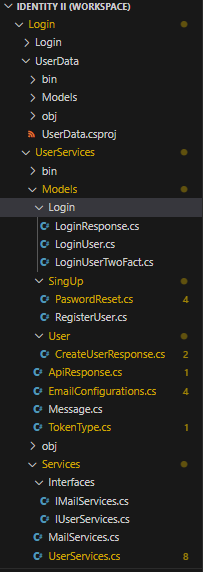

# Anglular.Net

En este tutorial es un complemento de los tutoriales pasados [Identity-on-ASP.Net-I](https://github.com/leandroVece/Identity-on-ASP.Net-I) y [Identity-on-ASP.Net-II](https://github.com/leandroVece/Identity-on-ASP.Net-II) usando a Angular como Frond de nuestra aplicacion. Por lo tanto como complemento no vamos a entrar en detalles sobre el back porque ya fueron tocados en los anteriores temas. Simplemente vamos a corrgir el error que comente sobre **problema de dependecia ciclica** mecionado el segundo tutorial.

## Creacion de un nuevo proyecto

Como siempre vamos a crear un nuevo proyecto. Para el caso de angular al igual que con react Dotnet ya ofrece un entorno de trabajo previamente configurado.

    dotnet new angular -o NombreDeTuProyecto

Una vez creado el proyecto vamos a crear 2 Classlib, uno para la coneccion a la base de datos y el otro para los servicios. De esta manera al independisar la la creacion de la base de datos de los servicios nuestro codigo se vuelve mas lineal.

Antes cuando no separamos estas instacias, nuestros proyecto principal iba a nuestro servicios y estos volvian a nuestro proyecto principal para consumir la base de datos todo en un ciclo. Ahora con una nueva instancia, este desde los servicios va a ir a la nueva lista de clases para poder consumir la base de datos.

    dotnet new classlib -n UserServices
    dotnet new classlib -n UserData

Lo demas es practivamente lo mismo que vimos en los anteriores tutotiales. Para eviar conficiones voy a agregar simple introduciones del codigo sin profundizar demaciado.

Las dependecias que vamos a usar en nuestras classLib llamada UserData son las que necesitaremos para crear y acceder a nuestra base de datos.

    dotnet add package Microsoft.EntityFrameworkCore.Sqlite --version
    dotnet add package Microsoft.AspNetCore.Identity.EntityFrameworkCore --version
    dotnet add package Microsoft.EntityFrameworkCore --version
    dotnet add package Microsoft.EntityFrameworkCore.Tools --version 
    

>**Recordatorio importante:** recuerden que cada paquete de dependecia tiene que instalarse dentro de la ruta donde se va a usar. En este caso todos van a estar instalados en la lista de clases llamada UserData.

***Path: ./UserData/UserData.csproj**

    <Project Sdk="Microsoft.NET.Sdk">

    <PropertyGroup>
        <TargetFramework>net7.0</TargetFramework>
        <ImplicitUsings>enable</ImplicitUsings>
        <Nullable>enable</Nullable>
    </PropertyGroup>

    <ItemGroup>
        <PackageReference Include="Microsoft.AspNetCore.Authentication.JwtBearer" Version="7.0.14" />
        <PackageReference Include="Microsoft.AspNetCore.Identity.EntityFrameworkCore" Version="7.0.14" />
        <PackageReference Include="Microsoft.EntityFrameworkCore.Sqlite" Version="7.0.14" />
        <PackageReference Include="Microsoft.EntityFrameworkCore.Tools" Version="7.0.14">
        <IncludeAssets>runtime; build; native; contentfiles; analyzers; buildtransitive</IncludeAssets>
        <PrivateAssets>all</PrivateAssets>
        </PackageReference>
    </ItemGroup>

    </Project>

***Path: ./UserData/Models/ApplicationUser.cs**

    namespace UserData.Models;

    public class ApplicationUser : IdentityUser
    {
        public string TokenRefresh { get; set; }
        public DateTime TokenRefreshExpiry { get; set; }
    }

***Path: ./UserData/Models/DataContext.cs**

    namespace UserData.Models;

    public class DataContext : IdentityDbContext<ApplicationUser>
    {
        public DataContext(DbContextOptions<DataContext> options) : base(options)
        { }
        protected override void OnModelCreating(ModelBuilder builder)
        {
            base.OnModelCreating(builder);
            SeedRoles(builder);
        }

        private static void SeedRoles(ModelBuilder builder)
        {
            builder.Entity<IdentityRole>().HasData(
                new IdentityRole() { Name = "Admin", ConcurrencyStamp = "1", NormalizedName = "ADMIN" },
                new IdentityRole() { Name = "User", ConcurrencyStamp = "2", NormalizedName = "USER" },
                new IdentityRole() { Name = "HR", ConcurrencyStamp = "3", NormalizedName = "RRHH" }
            );
        }
    }

Con esto terminariamos por el momento la parte de la creacion de la base de datos, ahora vamos a ir a consumir los servicios. De la misma manera que lo hicimos en los tutoriales pasados, para poder acceder a los modelos de una classLib diferente necesitamos agregarlo en nuestro archivo **-csproj**

Para esto primero vamos a instalar la dependencia que nos permitira enviar correos electronico desde nuestra aplicacion.

    dotnet add package NETCore.MailKit --version 2.1.0
    dotnet add package Microsoft.AspNetCore.Authentication.JwtBearer --version 
    

Ahora con esto listo Nuestro archivo Proyect estaria de la siguiente manera.
***Path: ./UserManagerServices/UserManagerServices.csproj**

    <Project Sdk="Microsoft.NET.Sdk">

    <PropertyGroup>
        <TargetFramework>net7.0</TargetFramework>
        <ImplicitUsings>enable</ImplicitUsings>
        <Nullable>enable</Nullable>
    </PropertyGroup>

    <ItemGroup>
        <PackageReference Include="Microsoft.AspNetCore.Authentication.JwtBearer" Version="7.0.14" />
        <PackageReference Include="NETCore.MailKit" Version="2.1.0" />
    </ItemGroup>
    
    <ItemGroup>
        <ProjectReference Include="..\UserData\UserData.csproj" />
    </ItemGroup>

    </Project>

Todos los demas archivos se conservaran tal y como estaban en el tutorial pasado. Puedes verlos desde [aqui](./UserServices/) o puedes copiarlo desde el otro tutorial. Adjunto foto confirmar lo que digo y mostrar una estructura temprana de nuestro codigo.

Ahora solo nos falta configurar el archivo Appssettings y nuestro archivo program. Como estos dos permanecen exactamente iguales no vamos a tocarlos simplmenente vamos recordar que estos dos son los unicos que faltan para poder comenzar con las migraciones. Como siempre no nos olvidemos de llamar a nuestra lista de clases a nuestro proyecto principal.

**Path: ./Login/Login.csproj**

    <Project Sdk="Microsoft.NET.Sdk.Web">

        <PropertyGroup>
            <TargetFramework>net7.0</TargetFramework>
            <Nullable>enable</Nullable>
            <IsPackable>false</IsPackable>
            <SpaRoot>ClientApp\</SpaRoot>
            <SpaProxyServerUrl>https://localhost:44404</SpaProxyServerUrl>
            <SpaProxyLaunchCommand>npm start</SpaProxyLaunchCommand>
            <ImplicitUsings>enable</ImplicitUsings>
        </PropertyGroup>

        <ItemGroup>
            <PackageReference Include="Microsoft.AspNetCore.SpaProxy" Version="7.0.11" />
            <PackageReference Include="Swashbuckle.AspNetCore" Version="6.5.0" />
        </ItemGroup>

        <ItemGroup>
            <!-- Don't publish the SPA source files, but do show them in the project files list -->
            <Content Remove="$(SpaRoot)**" />
            <None Remove="$(SpaRoot)**" />
            <None Include="$(SpaRoot)**" Exclude="$(SpaRoot)node_modules\**" />
        </ItemGroup>

            <Target Name="DebugEnsureNodeEnv" BeforeTargets="Build" Condition=" '$(Configuration)' == 'Debug' And !Exists('$(SpaRoot)node_modules') ">
            <!-- Ensure Node.js is installed -->
            <Exec Command="node --version" ContinueOnError="true">
            <Output TaskParameter="ExitCode" PropertyName="ErrorCode" />
            </Exec>
            <Error Condition="'$(ErrorCode)' != '0'" Text="Node.js is required to build and run this project. To continue, please install Node.js from https://nodejs.org/, and then restart your command prompt or IDE." />
            <Message Importance="high" Text="Restoring dependencies using 'npm'. This may take several minutes..." />
            <Exec WorkingDirectory="$(SpaRoot)" Command="npm install" />
        </Target>
        
        <Target Name="PublishRunWebpack" AfterTargets="ComputeFilesToPublish">
            <!-- As part of publishing, ensure the JS resources are freshly built in production mode -->
            <Exec WorkingDirectory="$(SpaRoot)" Command="npm install" />
            <Exec WorkingDirectory="$(SpaRoot)" Command="npm run build -- --configuration production" />

            <!-- Include the newly-built files in the publish output -->
            <ItemGroup>
            <DistFiles Include="$(SpaRoot)dist\**; $(SpaRoot)dist-server\**" />
            <ResolvedFileToPublish Include="@(DistFiles->'%(FullPath)')" Exclude="@(ResolvedFileToPublish)">
                <RelativePath>wwwroot\%(RecursiveDir)%(FileName)%(Extension)</RelativePath>
                <CopyToPublishDirectory>PreserveNewest</CopyToPublishDirectory>
                <ExcludeFromSingleFile>true</ExcludeFromSingleFile>
            </ResolvedFileToPublish>
            </ItemGroup>

        </Target>
        
        <ItemGroup>
            <ProjectReference Include="..\UserManagerServices\UserManagerServices.csproj" />
        </ItemGroup>

    </Project>

Ahora si nos posicionamos en nuestra carpeta donde esta el dataContext y realizaciomos las migraciones como ya conocemos seguramente nos saldra este error.

>Unable to create an object of type 'DataContext'. For the different patterns supported at design time, see https://go.microsoft.com/fwlink/?linkid=851728

Si entremos en el enlace encontraremos la respues: *Algunos de los comandos de EF Core Tools (por ejemplo, los comandos Migrations ) requieren que se cree una instancia derivada DbContext en tiempo de diseño para recopilar detalles sobre los tipos de entidad de la aplicación y cómo se asignan a un esquema de base de datos. En la mayoría de los casos, es deseable que el DbContext objeto creado se configure de forma similar a cómo se configuraría en tiempo de ejecución.*

Esto podría implicar implementar la interfaz IDesignTimeDbContextFactory<DataContext> en una clase separada para permitir que EF Core cree instancias de tu clase DataContext durante el tiempo de diseño.

***Path: ./UserData/Models/Data.cs**

    using Microsoft.EntityFrameworkCore;
    using Microsoft.EntityFrameworkCore.Design;
    using Microsoft.Extensions.Configuration;
    namespace UserData.Models;

    public class DataContextDesignTimeFactory : IDesignTimeDbContextFactory<DataContext>
    {
        public DataContext CreateDbContext(string[] args)
        {
            // Configura la construcción del contexto de datos utilizando un constructor vacío
            var optionsBuilder = new DbContextOptionsBuilder<DataContext>();

            // Obtiene el directorio actual del proceso (donde se ejecuta el comando)
            string currentDirectory = Directory.GetCurrentDirectory();

            // Establece la ruta base para buscar el archivo appsettings.json
            string basePath = Path.Combine(currentDirectory, "..", "Login");

            // Carga la configuración desde el archivo appsettings.json en la nueva ubicación
            IConfigurationRoot configuration = new ConfigurationBuilder()
                .SetBasePath(basePath)
                .AddJsonFile("appsettings.json")
                .Build();

            // Configura la cadena de conexión
            optionsBuilder.UseSqlite(configuration.GetConnectionString("SQLite"));

            // Crea una instancia de DataContext con las opciones de contexto configuradas
            return new DataContext(optionsBuilder.Options);
        }
    }

Con esto podemos realizar las migraciones para crear nuestra base de datos.

Despues de esto solo queda replicar los controladores y los modeslos de la clase principal. Como en este tutorial no voy a tocar el back mas de lo que ya lo hice, no voy a refactorizar los servicios y los controladores, para no perder tiempo en explicarlo.

## Font

De la misma manera que cuando creamos nuestro proyecto con react, la parte del Fort que corresponde a angular se encuentra en la carpeta de ClienApp. En esta carpeta vamos a entrar en **app -> Components** y vamos a eliminar todos los componentes dentro de la carpeta dejando solo las que corresponde al **app.moudule** que se encuentra fuera.

Como ya hemos hablado anteriormente sobre como manejar Angular, solo voy a tocar los temas relacionado al funcionamiento que se conecta con el back. Temas como la inyeccion de dependencias, interceptores y demas seran tocados muy superficialmente. El tema de los provedores o de las declaraciones seran pasados de largo, por lo que pueden ver en este proyecto o en los tutoriales sobre Angular de este repositorio.

Ahora podemos comenzar con lo primero que seria la creacion de nuevos componentes que nos van a permitir interactuar con el backend. Para este caso no hay necesidad de crearlo a travez del comando de terminal, podemos crearlo manualmente. Para ellos solo tenemos que crear un nuevo archivo ts como por ejemplo:

**Path: ./Login/ClientApp/src/app/components/error.component.ts**

    import { Component } from '@angular/core';

    @Component({
        selector: 'app-error',
        templateUrl: './error.component.html',
        styleUrls: ['./error.component.css']
    })

    export class NotFoundComponent {

    }

Con esta simple estructura podemos crear nuevos componentes. De la misma crearemos un componene **home, setting, forgot-password-layout, nav, reset-password** Todos estos componentes tienen que ser invocados en nuestro app.module

**Path: ./Login/ClientApp/src/app/app.module.ts**

    import { BrowserModule } from '@angular/platform-browser';
    import { NgModule } from '@angular/core';
    import { FormsModule, ReactiveFormsModule } from '@angular/forms';
    import { HTTP_INTERCEPTORS, HttpClientModule } from '@angular/common/http';

    import { AppComponent } from './app.component';
    import { HomeComponent } from './home/home.component';
    import { AppRoutingModule } from './app-routing.module';
    import { TokenInterceptor } from '../Interceptor/token.interceptor';
    import { SettingsComponent } from './settings/settings.component';
    import { TokenService } from '../services/TokenServices';
    import { LayoutComponent } from './layout/layout.component';
    import { NavComponent } from './nav/nav.component';
    import { JwtHelperService, JwtModule } from '@auth0/angular-jwt';
    import { ForgotPasswordComponent } from './Forgot-password/Forgot-password.component';
    import { ResetPasswordComponent } from './Reset-password/Reset-password.component';
    import { AuthService } from '../services/AuthServices.services';

    @NgModule({
    declarations: [
        AppComponent,
        HomeComponent,
        SettingsComponent,
        NavComponent,
        ForgotPasswordComponent,
        ResetPasswordComponent,
        LayoutComponent
    ],
    imports: [
        BrowserModule.withServerTransition({ appId: 'ng-cli-universal' }),
        HttpClientModule,
        FormsModule,
        ReactiveFormsModule,
        AppRoutingModule,
        JwtModule.forRoot({
        config: {
            // tokenGetter: getToken,
            // allowedDomains: ["example.com"],
            // disallowedRoutes: ["http://example.com/examplebadroute/"],
        },
        }),

    ],
    providers: [
        TokenService,
        AuthService,
        {
        provide: HTTP_INTERCEPTORS,
        useClass: TokenInterceptor,
        multi: true
        }],
    bootstrap: [AppComponent]
    })
    export class AppModule { }

>Recordatorio: aqui no se explicara paso por paso, ya que se hablo anteriormente, simplemente mostraremos como quedo el resultado final despues.

Comencemos con la creacion del Home. Como este trabajo es puramente practico vamos a hacer que tanto el login como el registro sea parte de este componenente, para ello vamos a necesitar un poco de Boostrap. Ahora, si bien boostrap biene intalado por defecto todavia tenemos que llamarlo para que nuestra app pueda reconocerlo para ello vamos a ir a nuestro archivo angular.json para agregar las ruta donde se encuentra los archivo de boostrap

**Path: ./Login/ClientApp/src/angular.json**

    
    {
        ...,
        "architect": {
        "build": {
          "builder": "@angular-devkit/build-angular:browser",
          "options": {
            "progress": false,
            "outputPath": "dist",
            "index": "src/index.html",
            "main": "src/main.ts",
            "polyfills": "src/polyfills.ts",
            "tsConfig": "tsconfig.app.json",
            "allowedCommonJsDependencies": [
              "oidc-client"
            ],
            "assets": [
              "src/assets"
            ],
            "styles": [
              "node_modules/bootstrap/dist/css/bootstrap.min.css",
              "node_modules/@fortawesome/fontawesome-free/css/all.min.css",
              "src/styles.css"
            ],
            "scripts": [
              "node_modules/jquery/dist/jquery.min.js",
              "node_modules/bootstrap/dist/js/bootstrap.bundle.min.js"
            ]
          },
          ....
        }
        }
    }

>Nota: El modulo fontawesome son emojin, este no esta instalado de manera predeterminada por lo que tendran que instalarlos.

### Home

Ahora que boostrap esta funcionando comencemo con la creacion del Home. Como este proyecto es puramente practico vamos a usar el home para el login y el registro.

**Path: ./Login/ClientApp/src/app/components/home.component.ts**

    import { Component } from '@angular/core';
    import { FormBuilder, FormGroup, Validators } from '@angular/forms';
    import { Tokens } from '../..//Models/Token.models';
    import { UserLogin, UserRegister } from 'src/app/Models/User.Models';
    import { MyValidators } from '../../Utils/Validatoes';

    import { Router } from '@angular/router';
    import { UserServices } from '../../services/userServices';

    declare var bootstrap: any;

    @Component({
        selector: 'app-home',
        templateUrl: './home.component.html',
        styleUrls: ['./home.component.css']
    })

    export class HomeComponent {

        formLogin!: FormGroup;
        formRegister!: FormGroup;

        userLogin: UserLogin | null = null;
        userRegister: UserRegister | null = null;

        responseTokens!: Tokens;

        constructor(private userServices: UserServices, private fb: FormBuilder, private router: Router) {
            this.builderLoginForm();
            this.builderRegisterForm();
        }

        private builderLoginForm() {
            this.formLogin = this.fb.group({
                userName: ['', [Validators.required]],
                password: ['', [Validators.required, Validators.minLength(8), MyValidators.validPassword]],
            })
        }

        private builderRegisterForm() {
            this.formRegister = this.fb.group({
                userName: ['', [Validators.required]],
                email: ['', [Validators.required]],
                password: ['', [Validators.required, Validators.minLength(8), MyValidators.validPassword]],
                confirmPassword: ['', [Validators.required, Validators.minLength(8), MyValidators.validPassword]],
                roles: [['User']]
            }, {
                validators: MyValidators.matchPasswords
            });
        }

        ngAfterViewInit() {
            const triggerTabList = Array.from(document.querySelectorAll('#ex1 a'));
            triggerTabList.forEach(function (triggerEl) {
                const tabTrigger = new bootstrap.Tab(triggerEl);

                triggerEl.addEventListener('click', function (event) {
                    event.preventDefault();
                    tabTrigger.show();
                });
            });
        }

        onLogin() {
            if (this.formLogin.valid) {
                this.userLogin = this.formLogin.value;
                //console.log(this.formLogin.value);
                this.userServices.Login(this.userLogin!).subscribe(
                    res => {
                        // Manejar la respuesta del backend
                        console.log('Respuesta del backend:', res);
                        // console.log('Respuesta del backend:', res.response?.TokenAcces.Token);

                    })
            } else {
                if (!this.userNameFieldLogin?.valid && this.passwordFieldLogin?.valid) {
                    alert("El usuario debe estar cargado");
                }
                if (this.userNameFieldLogin?.valid && !this.passwordFieldLogin?.valid) {
                    alert("La contraseña debe tener al menos 8 caracteres, una mayúscula y un carácter especial");
                }
                alert("Los campos deben rellenarse correctamente");
            }
        }

        onRegister() {
            if (this.formRegister.valid) {
                console.log(this.formRegister.value)
                const { confirmPassword, ...userData } = this.formRegister.value;
                this.userRegister = userData;

                this.userServices.Register(this.userRegister!).subscribe(
                    response => {
                        // Manejar la respuesta del backend
                        console.log('Respuesta del backend:', response);
                    },
                    error => {
                        // Manejar cualquier error en la solicitud HTTP
                        console.error('Error al enviar el formulario de registro al backend:', error);
                        console.log(error);

                    })
            } else {
                if (!this.formLogin.get("userName")?.valid) {
                    alert("El nombre de usuario debe ser válido.");
                } else if (!this.formLogin.get("password")?.valid) {
                    alert("La contraseña debe tener al menos 8 caracteres, una mayúscula y un carácter especial.");
                } else if (!this.formLogin.get("email")?.valid) {
                    alert("El email debe ser válido.");
                } else {
                    alert("Por favor, rellene correctamente todos los campos.");
                }
            }
        }

        navigateTo() {
            this.router.navigate(['forgot-password']);
        }

        get passwordField() {
            return this.formRegister.get('password')!;
        }

        get confirmPasswordField() {
            return this.formRegister.get('confirmPassword')!;
        }

        get emailField() {
            return this.formRegister.get('email')!;
        }

        get userNameField() {
            return this.formRegister.get('userName')!;
        }

        get userNameFieldLogin() {
            return this.formLogin.get('userName')!;
        }
        get passwordFieldLogin() {
            return this.formLogin.get('password')!;
        }

    }

**Path: ./Login/ClientApp/src/app/components/home.component.htlm**

    <section class="Login-register mt-5">
        <!-- Pills navs -->
        <ul class="nav nav-pills nav-justified mb-3" id="ex1" role="tablist">
            <li class="nav-item" role="presentation">
                <a class="nav-link active" id="tab-login" data-mdb-toggle="pill" href="#pills-login" role="tab"
                    aria-controls="pills-login" aria-selected="true">Login</a>
            </li>
            <li class="nav-item" role="presentation">
                <a class="nav-link" id="tab-register" data-mdb-toggle="pill" href="#pills-register" role="tab"
                    aria-controls="pills-register" aria-selected="false">Register</a>
            </li>

        </ul>
        <!-- Pills navs -->

        <!-- Pills content -->
        

            

                <form [formGroup]="formLogin" (ngSubmit)="onLogin()">
                    

                        
Sign in with:

                        <button type="button" class="btn btn-link btn-floating mx-1">
                            <i class="fab fa-facebook-f"></i>
                        </button>

                        <button type="button" class="btn btn-link btn-floating mx-1">
                            <i class="fab fa-google"></i>
                        </button>

                        <button type="button" class="btn btn-link btn-floating mx-1">
                            <i class="fab fa-twitter"></i>
                        </button>

                        <button type="button" class="btn btn-link btn-floating mx-1">
                            <i class="fab fa-github"></i>
                        </button>
                    

                    
or:

                    <!-- username input -->
                    

                        <label class="form-label" for="loginName">Username</label>
                        <input type="text" id="loginName" formControlName="userName" class="form-control" required />
                        

                            El nombre de usuario es requerido.
                        

                    

                    <!-- Password input -->
                    

                        <label class="form-label" for="loginPassword">Password</label>
                        <input type="password" id="loginPassword" formControlName="password" class="form-control"
                            required />
                        

                            La contraseña es requerida y debe tener al menos 8 caracteres.
                        

                    

                    <!-- 2 column grid layout -->
                    

                        

                            <!-- Checkbox -->
                            <label class="form-check-label" for="loginCheck"> Remember me </label>
                            

                                <input class="form-check-input" type="checkbox" value="" id="loginCheck" checked />
                            

                        

                        

                            <!-- Simple link -->
                            <a (click)="navigateTo()" class="nav-item">Forgot password?</a>
                        

                    

                    <!-- Submit button -->
                    <!-- <button type="submit" class="btn btn-primary btn-block mb-4" [disabled]="!formLogin.valid">Sign -->
                    <button type="submit" class="btn btn-primary btn-block mb-4">Sign
                        in</button>

                    <!-- Register buttons -->
                    

                        
Not a member? <a href="#!">Register</a>

                    

                </form>
            

            

                <form [formGroup]="formRegister" (ngSubmit)="onRegister()">
                    

                        
Sign up with:

                        <button type="button" class="btn btn-link btn-floating mx-1">
                            <i class="fab fa-facebook-f"></i>
                        </button>

                        <button type="button" class="btn btn-link btn-floating mx-1">
                            <i class="fab fa-google"></i>
                        </button>

                        <button type="button" class="btn btn-link btn-floating mx-1">
                            <i class="fab fa-twitter"></i>
                        </button>

                        <button type="button" class="btn btn-link btn-floating mx-1">
                            <i class="fab fa-github"></i>
                        </button>
                    

                    
or:

                    <!-- Name input -->
                    

                        <label class="form-label" for="registerName">userName</label>
                        <input type="text" id="registerName" formControlName="userName" class="form-control" />
                        

                            nombre del usuario es requerido
                        

                    

                    <!-- Email input -->
                    

                        <label class="form-label" for="registerEmail">Email</label>
                        <input type="email" id="registerEmail" formControlName="email" class="form-control" />
                        

                            correo es requerido
                        

                    

                    <!-- Password input -->
                    

                        <label class="form-label" for="registerPassword">Password</label>
                        <input type="password" id="registerPassword" formControlName="password" class="form-control" />
                        

                            La contraseña es requerida y debe ser Alfanumerica tener al menos 8 caracteres, 1 mayuscula 1
                            caracter especial.
                        

                    

                    <!-- Repeat Password input -->
                    

                        <label class="form-label" for="registerRepeatPassword">Repeat password</label>
                        <input type="password" id="registerRepeatPassword" formControlName="confirmPassword"
                            class="form-control" />
                        

                            La contraseña no son iguales.
                        

                    

                    <!-- Checkbox -->
                    

                        <label class="form-check-label" for="registerCheck">
                            <input class="form-check-input me-2" type="checkbox" value="" id="registerCheck" checked
                                aria-describedby="registerCheckHelpText" />
                            I have read and agree to the terms
                        </label>
                    

                    <!-- Submit button -->
                    <!-- <button type="submit" class="btn btn-primary btn-block mb-3" [disabled]="!formRegister.valid">Sign -->
                    <button type="submit" class="btn btn-primary btn-block mb-3">Sign
                        in</button>
                </form>
            

        

        <!-- Pills content -->
    </section>

### Setting

Esta vista la vamos a usar para activar configuracion de 2 pasos.

**Path: ./Login/ClientApp/src/app/components/settings/settings.component.ts**

    import { Component } from '@angular/core';
    import { FormBuilder, FormGroup } from '@angular/forms';

    import { UserServices } from '../../services/userServices';
    import { TokenService } from '../../services/TokenServices';
    import { JwtHelperService } from '@auth0/angular-jwt';
    import { EMAIL_CLAIM_KEY } from 'src/app/constant';
    import { UserTwoFactoryLogin } from 'src/app/Models/User.Models';

    @Component({
        selector: 'app-settings',
        templateUrl: './settings.component.html',
        styleUrls: ['./settings.component.css']
    })

    export class SettingsComponent {

        Form!: FormGroup;
        data!: UserTwoFactoryLogin;

        constructor(private formBuilder: FormBuilder, private userServices: UserServices,
            private TokenService: TokenService, private jwtHelper: JwtHelperService) {
            this.builderSettingsForm();
        }

        submitForm() {
            // Aquí puedes manejar el envío del formulario, como enviar los datos al servidor
            this.userServices.Settings(this.Form.value).subscribe(
                res => {
                    console.log('Respuesta del backend:', res)
                });
        }

        private builderSettingsForm() {
            const token = this.TokenService.getToken();
            if (token) {
                const decoded = this.jwtHelper.decodeToken(token.tokenAcces.token);
                const email = decoded[EMAIL_CLAIM_KEY];
                this.Form = this.formBuilder.group({
                    TowFactory: false, // Valor inicial del checkbox
                    email: [email]
                });
            } else {
                // Manejo del caso en el que el token no está disponible
                alert('No se encontró el token de acceso o el token esta vencido');
            }
        }

    }

**Path: ./Login/ClientApp/src/app/components/settings/settings.component.html**

    <section class="">

        <h1 class="container d-flex justify-content-center">Configuracion de cuenta</h1>

        

            

                <form [formGroup]="Form" (ngSubmit)="submitForm()">
                    

                        

                            <label class="form-check-label h4" for="switchCheckLabelStart">Verificacion de 2 pasos</label>
                            <input class="form-check-input ms-0 h4" formControlName="TowFactory" type="checkbox"
                                role="switch" id="switchCheckLabelStart" />
                        

                    

                    

                        <button type="submit" class="btn btn-primary mt-3">Enviar</button>
                    

                </form>
            

        

    </section>

### Forgot-Password

Este vista vamos a cargar nuestro email donde se enviara un correo con un hipervinculo que contendra la direccion, el email y el token para recuperar la contraseña.

**Path: ./Login/ClientApp/src/app/components/Forgot-Password/Forgot-Password.component.html**

    <form class="w-25 m-auto" [formGroup]="FormPasswordReset" (ngSubmit)="onSutmit()">
        

            
continue with

            <button type="button" class="btn btn-link btn-floating mx-1">
                <i class="fab fa-facebook-f"></i>
            </button>

            <button type="button" class="btn btn-link btn-floating mx-1">
                <i class="fab fa-google"></i>
            </button>

            <button type="button" class="btn btn-link btn-floating mx-1">
                <i class="fab fa-twitter"></i>
            </button>

            <button type="button" class="btn btn-link btn-floating mx-1">
                <i class="fab fa-github"></i>
            </button>
        

        
or:

        

            <label class="form-label" for="registerEmail">Email</label>
            <input type="email" id="registerEmail" formControlName="email" class="form-control" />
            

                correo es requerido
            

        

        <!-- Submit button -->
        <!-- <button type="submit" class="btn btn-primary btn-block mb-4" [disabled]="!formLogin.valid">Sign -->
        <button type="submit" class="btn btn-primary btn-block mb-4"> Submit </button>

    </form>

**Path: ./Login/ClientApp/src/app/components/Forgot-Password/Forgot-Password.component.ts**

    import { Component } from '@angular/core';
    import { FormBuilder, FormGroup, Validators } from '@angular/forms';
    import { Router } from '@angular/router';
    import { UserServices } from 'src/app/services/userServices';

    @Component({
        selector: 'app-Forgot-password',
        templateUrl: './Forgot-password.component.html',
        styleUrls: ['./Forgot-password.component.css']
    })

    export class ForgotPasswordComponent {

        FormPasswordReset!: FormGroup;

        constructor(private userServices: UserServices,
            private fb: FormBuilder, private router: Router,) {
            this.builderFormPasswordReset();
        }

        onSutmit() {
            if (this.FormPasswordReset.value) {
                this.userServices.ForgotPassword(this.FormPasswordReset.value).subscribe(
                    response => {
                        // Manejar la respuesta del backend
                        console.log('Respuesta del backend:', response);
                    },
                    error => {
                        // Manejar cualquier error en la solicitud HTTP
                        console.error('Error al enviar el formulario de registro al backend:', error);
                    })
            } else {
                alert("Falta cargar el Email")
            }

        }

        private builderFormPasswordReset() {
            this.FormPasswordReset = this.fb.group({
                email: ['', [Validators.required]],
            });
        }

        get emailField() {
            return this.FormPasswordReset.get('email')!;
        }
    }

### Reset Password

Este componente vamos a usarlo para reestablecer la contraseña. Este compomente sera la ruta final de nuestro hipervinculo que enviamos anteriormente. Desde la url captara el token y el email para que solo nos encarguemos de cargar el nuevo email.

**Path: ./Login/ClientApp/src/app/components/Forgot-Password/Reset-Password.component.html**

    <form class="w-25 m-auto" [formGroup]="FormPasswordReset" (ngSubmit)="onSutmit()">

        <!-- token input -->
        

            <label class="form-label" for="loginName">Token</label>
            <input type="text" id="loginName" formControlName="token" class="form-control" required />
            

                El Token de usuario es requerido.
            

        

        <!-- Email input -->
        

            <label class="form-label" for="registerEmail">Email</label>
            <input type="email" id="registerEmail" formControlName="email" class="form-control" />
            

                correo es requerido
            

        

        <!-- Password input -->
        

            <label class="form-label" for="registerPassword">Password</label>
            <input type="password" id="registerPassword" formControlName="password" class="form-control" />
            

                La contraseña es requerida y debe ser Alfanumerica tener al menos 8 caracteres, 1 mayuscula 1
                caracter especial.
            

        

        <!-- Repeat Password input -->
        

            <label class="form-label" for="registerRepeatPassword">Repeat password</label>
            <input type="password" id="registerRepeatPassword" formControlName="confirmPassword" class="form-control" />
            

                La contraseña no son iguales.
            

        

        <!-- Submit button -->
        <!-- <button type="submit" class="btn btn-primary btn-block mb-4" [disabled]="!formLogin.valid">Sign -->
        <button type="submit" class="btn btn-primary btn-block mb-4"> Submit </button>

    </form>

**Path: ./Login/ClientApp/src/app/components/Forgot-Password/Reset-Password.component.ts**

    import { Component } from '@angular/core';
    import { FormBuilder, FormGroup, Validators } from '@angular/forms';
    import { UserServices } from '../../services/userServices'; // Assuming correct import path

    import { Router, ActivatedRoute } from '@angular/router';
    import { MyValidators } from '../../Utils/Validatoes';

    @Component({
        selector: 'app-reset-password',
        templateUrl: './Reset-password.component.html',
        styleUrls: ['./Reset-password.component.css']
    })
    export class ResetPasswordComponent {

        FormPasswordReset!: FormGroup;
        tokenUrl: string | null = null;
        emailUrl: string | null = null;

        constructor(
            private userServices: UserServices,
            private fb: FormBuilder,
            private router: Router,
            private route: ActivatedRoute // Inject ActivatedRoute for URL parameter access
        ) {
            this.route.queryParams.subscribe(params => {
                this.tokenUrl = params['Token']; // Using correct casing 'Token'
                this.emailUrl = params['email'];
                // Call the builderFormPasswordReset function after capturing parameters:
                this.builderFormPasswordReset();
            });
        }

        private builderFormPasswordReset() {
            this.FormPasswordReset = this.fb.group({
                token: [this.tokenUrl, [Validators.required]],
                email: [this.emailUrl, [Validators.required]],
                password: ['', [Validators.required, Validators.minLength(8), MyValidators.validPassword]],
                confirmPassword: ['', [Validators.required, Validators.minLength(8), MyValidators.validPassword]],
            }, {
                validators: MyValidators.matchPasswords
            });
        }

        onSutmit() {
            if (this.FormPasswordReset.valid) {

                const { confirmPassword, ...userData } = this.FormPasswordReset.value;

                this.userServices.ResetPassword(userData!).subscribe(
                    response => {
                        // Manejar la respuesta del backend
                        console.log('Respuesta del backend:', response);
                    },
                    error => {
                        // Manejar cualquier error en la solicitud HTTP
                        console.error('Error al enviar el formulario de registro al backend:', error);
                    })
            } else {
                if (!this.FormPasswordReset.get("password")?.valid) {
                    alert("La contraseña debe tener al menos 8 caracteres, una mayúscula y un carácter especial.");
                } else if (!this.FormPasswordReset.get("email")?.valid) {
                    alert("El email debe ser válido.");
                } else {
                    alert("Por favor, rellene correctamente todos los campos.");
                }
            }
        }

        get passwordField() {
            return this.FormPasswordReset.get('password')!;
        }

        get confirmPasswordField() {
            return this.FormPasswordReset.get('confirmPassword')!;
        }

        get emailField() {
            return this.FormPasswordReset.get('email')!;
        }

        get TokenField() {
            return this.FormPasswordReset.get('token')!;
        }
    }

## Servicios

Los servicios que usaremos en este proyecto nos ayudaran a hacer diferentes cosas. Por ejemplo en nuestro AuthServices comprobaremos el estado de coneccion del Usuario. Si el token todavia es valido generaremos el nuevo token de acceso hasta que el mismo expire.

**Path: ./Login/ClientApp/src/app/services/AuthService.services.ts**

    import { Injectable } from '@angular/core';
    import { JwtHelperService } from '@auth0/angular-jwt';

    import { Tokens } from '../Models/Token.models';
    import { TokenService } from './TokenServices';
    import { UserServices } from './userServices';
    import { ROLE_CLAIM_KEY } from '../constant';

    @Injectable({
        providedIn: 'root'
    })
    export class AuthService {
        constructor(private tokenService: TokenService, private userServices: UserServices, private jwtHelper: JwtHelperService) { }

        isLoggedIn(): boolean {
            const token = this.tokenService.getToken();
            console.log(token)
            if (token) {
                return this.validateToken(token);
            }
            return false;
        }

        validateToken(token: Tokens): boolean {
            // Convertir la cadena de fecha a un objeto Date
            const expiryDateToken = new Date(token.tokenAcces.timeExpiry);
            const expiryDateTokenRefres = new Date(token.tokenRefresh.timeExpiry);
            //agregar las horas de la zona horaria
            var expiryToken = expiryDateToken.setHours(expiryDateToken.getHours() + 3)
            var expiryRefresh = expiryDateTokenRefres.setHours(expiryDateToken.getHours() + 3)

            // Verifica si el token ha expirado
            if (new Date(expiryToken) > new Date()) {
                return true;
            } else {
                if (new Date(expiryRefresh) < new Date()) {
                    return false
                }

                this.userServices.RefreshToken(token).subscribe(response => {
                    // Manejar la respuesta del servidor
                    console.log(response);
                });
                return true;
            }
        }

        getUserRole(): string[] | null {
            const token = this.tokenService.getToken();
            if (token) {
                const decoded = this.jwtHelper.decodeToken(token.tokenAcces.token);
                const userRole = [decoded[ROLE_CLAIM_KEY]];

                return userRole[0];
            } else {
                return [];
            }

        }
    }

En UserServices realizaremos los diferentes pedidos a nuestra base de datos referente a las acciones de los Usuarios.

**Path: ./Login/ClientApp/src/app/services/userServices.ts**

    import { Injectable } from '@angular/core';
    import { HttpClient } from '@angular/common/http';
    import { Roles } from '../Models/Roles.models';
    import { PasswordReset, UserLogin, UserRegister, UserResponse, UserTwoFactoryLogin } from '../Models/User.Models';
    import { Tokens, TokensWithDate } from '../Models/Token.models';

    import { Observable, throwError } from 'rxjs';
    import { catchError, tap } from 'rxjs/operators';

    import { environment } from 'src/environments/environment';
    import { ApiResponse, Response } from '../Models/ApiResponse.models';

    import { TokenService } from './TokenServices';

    @Injectable({
        providedIn: 'root'
    })
    export class UserServices {

        constructor(private http: HttpClient,
            private TokenService: TokenService) { }

        getRoles(): Observable<Roles[]> {
            return this.http.post<Roles[]>(`${environment.Api_url}/Admin`, null)
                .pipe(catchError(error => {
                    //console.log('Error en la solicitud:', error);
                    return throwError(() => new Error(error));
                }));
        }

        Register(data: UserRegister): Observable<ApiResponse<UserResponse>> {
            return this.http.post<ApiResponse<UserResponse>>(`${environment.Api_url}/Authentication/register`, data)
                .pipe(catchError(error => {
                    return throwError(() => new Error(error));
                }))
        }

        Login(data: UserLogin): Observable<ApiResponse<Tokens>> {
            return this.http.post<ApiResponse<Tokens>>(`${environment.Api_url}/Authentication/login`, data)
                .pipe(tap(op => {
                    if (op.response) {
                        this.TokenService.saveToken(op.response);
                    }
                }))
        }

        RefreshToken(data: Tokens): Observable<TokensWithDate> {
            const tokens = this.TokenService.convertToken(data);

            return this.http.post<TokensWithDate>(`${environment.Api_url}/Authentication/refresh-token`, tokens)
                .pipe(
                    tap(op => {
                        console.log(op)
                        if (op) {
                            tokens!.tokenAcces = op.tokenAcces;
                            this.TokenService.saveToken(data);
                        }
                    }),
                    catchError(error => {
                        console.log(error);
                        return throwError(() => new Error(error));
                    })
                );
        }

        Settings(data: UserTwoFactoryLogin): Observable<Response> {
            return this.http.post<Response>(`${environment.Api_url}/Admin/settings`, data)
                .pipe(catchError(error => {
                    return throwError(() => new Error(error));
                }));
        }

        ForgotPassword(email: string): Observable<Response> {
            return this.http.post<Response>(`${environment.Api_url}/Authentication/Forgot-password`, email)
                .pipe(catchError(error => {
                    return throwError(() => new Error(error));
                }));
        }

        ResetPassword(data: PasswordReset): Observable<Response> {
            return this.http.post<Response>(`${environment.Api_url}/Authentication/reset-password`, data)
                .pipe(catchError(error => {
                    return throwError(() => new Error(error));
                }));
        }
    }

En TokenServices nos encargaremos de guardar el token, obtener el Token y convertir el token en un archivo del tipo que nuestra base de datos esta esperando.

**Path: ./Login/ClientApp/src/app/services/TokenServices.ts**

import { TokenType } from "@angular/compiler";
import { TokenDate, TokensWithDate, Tokens } from "../Models/Token.models";

export class TokenService {

    constructor() { }

    saveToken(token: Tokens) {
        console.log(token);
        const stringConvert = JSON.stringify(token);
        localStorage.setItem('token', stringConvert);
    }

    getToken(): Tokens | null {
        const token = localStorage.getItem('token');
        if (token) {
            return JSON.parse(token);
        }
        return null;
    }

    convertToken(tokens: Tokens): TokensWithDate | null {
        const tokenAccesWithDate: TokenDate = {
            token: tokens.tokenAcces.token,
            timeExpiry: new Date(tokens.tokenAcces.timeExpiry)
        };
        const tokenRefreshWithDate: TokenDate = {
            token: tokens.tokenRefresh.token,
            timeExpiry: new Date(tokens.tokenRefresh.timeExpiry)
        };
        const tokensWithDate: TokensWithDate = {
            tokenAcces: tokenAccesWithDate,
            tokenRefresh: tokenRefreshWithDate
        };
        return tokensWithDate;
    }

}

## Interceptor

Nuestro interceptor captara nuestras solicitudes y agregara el token de autorizacion en nuestras solicitudes http

**Path: ./Login/ClientApp/src/app/interceptor/token.interceptor.ts**

    import { Injectable } from '@angular/core';
    import { HttpRequest, HttpHandler, HttpEvent, HttpInterceptor } from '@angular/common/http';
    import { Observable, tap } from 'rxjs';
    import { TokenService } from '../services/TokenServices';
    import { environment } from 'src/environments/environment';

    @Injectable()
    export class TokenInterceptor implements HttpInterceptor {
    http: any;

    constructor(private tokenService: TokenService) { }

    intercept(request: HttpRequest<any>, next: HttpHandler): Observable<HttpEvent<any>> {
            // Verifica si la solicitud necesita un token de autorización
            //if (request.headers.has('Authorization')) {
            const token = this.tokenService.getToken();

            if (token) {
            // Clona la solicitud original y agrega el token de autorización
            const authReq = request.clone({
                headers: request.headers.set('Authorization', `Bearer ${token.tokenAcces.token}`)
            });

            // Envía la solicitud con el token adjunto
            return next.handle(authReq);
            }
            //}

            // Si no se necesita un token de autorización, sigue adelante con la solicitud original
            return next.handle(request);
        }
    }

##Guardian

Con nuestro guardian podremos verificar el estado de nuestro usuario cada vez que nosotros redireccionamos dentro de nuestro proyecto.

    import { Injectable } from '@angular/core';
    import { CanActivate, Router } from '@angular/router';
    import { AuthService } from '../services/AuthServices.services';

    @Injectable({
        providedIn: 'root'
    })
    export class AuthGuard implements CanActivate {

        constructor(private authService: AuthService, private router: Router) { }

        canActivate(): boolean {
            if (this.authService.isLoggedIn()) {
                //this.router.navigate(['/settings']);
                return true;
            } else {
                //this.router.navigate(['/home']); // Redirige al usuario a la página de inicio de sesión si no está autenticado
                return false;
            }
        }

    }